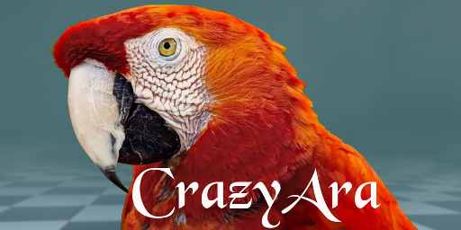

# CrazyAra - A Deep Learning Chess Variant Engine


## Contents
* [Description](#description)
* [Links](#links)
* [Download](#download)
    * [Binaries](#binaries)
    * [Models](#models)
* [Variants](#variants)
* [Compilation](#compilation)
    * [Linux](#linux)
    * [Windows](#windows)
* [Libraries](#libraries)
* [Licence](#licence)
* [Publication](#publication)


## Description

[CrazyAra](https://crazyara.org/) is an open-source neural network based engine, initially developed in pure python by [Johannes Czech](https://github.com/QueensGambit), [Moritz Willig](https://github.com/MoritzWillig) and Alena Beyer in 2018.
It started as a semester project at the [Technische Universität Darmstadt](https://www.tu-darmstadt.de/index.en.jsp) with the goal to train a neural network to play the chess variant [crazyhouse](https://en.wikipedia.org/wiki/Crazyhouse) via supervised learning on human data.
The project was part of the course [_"Deep Learning: Architectures & Methods"_](https://piazza.com/tu-darmstadt.de/summer2019/20001034iv/home) held by [Kristian Kersting](https://ml-research.github.io/people/kkersting/index.html), [Johannes Fürnkranz](http://www.ke.tu-darmstadt.de/staff/juffi) et al. in summer 2018.

The development was continued and the engine ported to C++ by [Johannes Czech](https://github.com/QueensGambit). In the course of a master thesis supervised by [Karl Stelzner](https://ml-research.github.io/people/kstelzner/) and [Kristian Kersting](https://ml-research.github.io/people/kkersting/index.html), the engine will learn crazyhouse in a reinforcement learning setting and ported to play other chess variants including classical chess.

The project is mainly inspired by the techniques described in the [Alpha-(Go)-Zero papers](https://arxiv.org/abs/1712.01815) by [David Silver](https://arxiv.org/search/cs?searchtype=author&query=Silver%2C+D), [Thomas Hubert](https://arxiv.org/search/cs?searchtype=author&query=Hubert%2C+T), [Julian Schrittwieser](https://arxiv.org/search/cs?searchtype=author&query=Schrittwieser%2C+J), [Ioannis Antonoglou](https://arxiv.org/search/cs?searchtype=author&query=Antonoglou%2C+I), [Matthew Lai](https://arxiv.org/search/cs?searchtype=author&query=Lai%2C+M), [Arthur Guez](https://arxiv.org/search/cs?searchtype=author&query=Guez%2C+A), [Marc Lanctot](https://arxiv.org/search/cs?searchtype=author&query=Lanctot%2C+M), [Laurent Sifre](https://arxiv.org/search/cs?searchtype=author&query=Sifre%2C+L), [Dharshan Kumaran](https://arxiv.org/search/cs?searchtype=author&query=Kumaran%2C+D), [Thore Graepel](https://arxiv.org/search/cs?searchtype=author&query=Graepel%2C+T), [Timothy Lillicrap](https://arxiv.org/search/cs?searchtype=author&query=Lillicrap%2C+T), [Karen Simonyan](https://arxiv.org/search/cs?searchtype=author&query=Simonyan%2C+K), [Demis Hassabis](https://arxiv.org/search/cs?searchtype=author&query=Hassabis%2C+D).

This repository contains the source code of the engine search written in C++ based on the previous [Python version](https://github.com/QueensGambit/CrazyAra).
The training scripts, preprocessing and neural network definition source files can be found in the [Python version](https://github.com/QueensGambit/CrazyAra).

CrazyAra is an UCI chess engine and requires a GUI (e.g. [Cute Chess](https://github.com/cutechess/cutechess), [XBoard](https://www.gnu.org/software/xboard/), [WinBoard](http://hgm.nubati.net/)) for convinient usage.

## Links

* [:earth_africa: Project website](https://crazyara.org/)
* [♞ Lichess.org account](https://lichess.org/@/CrazyAra/all)
* [:snake: Python version](https://github.com/QueensGambit/CrazyAra/)
* :notebook_with_decorative_cover: Crazya paper __TODO__

## Download

__TODO__
### Binaries

A binary release is provided for the following plattforms:

Operating System | Backend | Compatible with
--- | --- | ---
Linux | **CUDA 10.0, cuDNN v7.5.1.10, openBlas** | NVIDIA GPUs and CPU
Linux | **Intel MKL** | Intel CPUs
Windows | **CUDA 10.1, cuDNN v7.5.1.10, openBlas** | NVIDIA GPUs and CPU
Windows | **Intel MKL** | Intel CPUs

### Models

The following models are freely available for download:
* 4-value-8-policy
* 8-value-16-policy
* 8-value-policy-map
* 8-value-policy-map-mobile / RISEv2
* 8-value-policy-map-preAct-relu+bn
* RISEv1 (CrazyAraFish weights)

The extracted model should be placed in the same directory as the engine executable.
The directory can be changed by adjusting the UCI-parameter `Model_Directory`.
Each model is compatible with all executables.

More information about the different models can be found in the [wiki](https://github.com/QueensGambit/CrazyAra-Engine/wiki/Model-description).

## Variants
The current list of available chess variants include:
* [Crazyhouse](https://lichess.org/variant/crazyhouse)

## Compilation

Please follow these steps to build CrazyAra from source:

Clone the CrazyAra repository:

```$ git clone https://github.com/QueensGambit/CrazyAra-Engine.git --recursive```

1. Download and install the [**Blaze**](https://bitbucket.org/blaze-lib/blaze/src/master/) library of version **>=3.6** or current master:
	* https://bitbucket.org/blaze-lib/blaze/wiki/Configuration%20and%20Installation
	* https://bitbucket.org/blaze-lib/blaze/downloads/

### Linux

2. Build the MXNet C++ package (e.g. IntelMKL). Building with OpenCV is not required:

   ```$ make -j USE_CPP_PACKAGE=1 USE_OPENCV=0 USE_MKL=1```
   
   Detailed build instruction can be found here:
   	* https://mxnet.incubator.apache.org/versions/master/api/c++/index.html

3. Build the CrazyAra binary
```
$ export MXNET_PATH=<path_to_mxnet>/incubator-mxnet/
$ mkdir build
$ cd build
$ cmake -DCMAKE_BUILD_TYPE=Release ..
$ make
```

### Windows

2. Build the MXNet C++ package

Install all premilaries and depending on your preference follow the CUDA or MKL guide.

Make sure to install Visual Studio together with the VC++ toolset and enable Visual Studio support when installing CUDA.

* https://mxnet.incubator.apache.org/versions/master/install/windows_setup.html#build-from-source

_At the time of writing building the MXNet C++ package from master is causing issues._

_Therefore we use a fork where the bug in generating the op.h files has already been fixed._

* https://github.com/apache/incubator-mxnet/issues/15632

Clone the MXNet library:

```
$ git clone https://github.com/Vigilans/incubator-mxnet.git  --recursive```
$ git checkout patch-1
```

Configure the library with the options you need (e.g. CUDA, CUDNN). Building with OpenCV is not required:
```
cmake -G "Visual Studio 15 2017 Win64" -T cuda=10.1,host=x64 -DUSE_CUDA=1 -DUSE_CUDNN=1 -DUSE_CPP_PACKAGE=1 -DUSE_NVRTC=1 -DUSE_OPENCV=0 -DUSE_OPENMP=1 -DUSE_BLAS=open -DUSE_LAPACK=1 -DUSE_DIST_KVSTORE=0 -DCUDA_ARCH_LIST=Common -DCUDA_TOOLSET=10.1 -DCUDNN_INCLUDE="C:\Program Files\NVIDIA GPU Computing Toolkit\CUDA\v10.1\include" -DCUDNN_LIBRARY="C:\Program Files\NVIDIA GPU Computing Toolkit\CUDA\v10.1\lib\x64\cudnn.lib" "D:\libs\incubator-mxnet"
```
Start the building process:
```
msbuild mxnet.sln /p:Configuration=Release;Platform=x64 /maxcpucount
```

Generate the "op.h" file:
```
python OpWrapperGenerator.py "\your\build\Release\libmxnet.dll"
```
If this doesn't work on your system due to encoding errors, you can try downloading the file instead:
* https://github.com/dmlc/MXNet.cpp/blob/master/include/mxnet-cpp/op.h

3. Build the CrazyAra binary

```
$ set MXNET_PATH=<path_to_mxnet>/incubator-mxnet/
$ set BLAZE_PATH=<path_to_blaze>/Blaze_3.6/
$ mkdir build
$ cd build
$ cmake -G "Visual Studio 15 2017 Win64" ..
$ msbuild CrazyAra.sln /p:Configuration=Release;Platform=x64 /maxcpucount
```

## Libraries
The following libraries are used to run CrazyAra:

* [**Multi Variant Stockfish**](https://github.com/ddugovic/Stockfish): Stockfish fork specialized to play chess and some chess variants
	* Used for move generation and board representation as a replacement for [python-chess](https://github.com/niklasf/python-chess).
* [**MXNet C++ Package**](https://github.com/apache/incubator-mxnet/tree/master/cpp-package): A flexible and efficient library for deep learning
	* Used as the deep learning backend for loading and inference of the trained neural network
* [**Blaze**](https://bitbucket.org/blaze-lib/blaze/src/master/): An open-source, high-performance C++ math library for dense and sparse arithmetic
	* Used for arithmetic, numerical vector operation within the MCTS search as a replacement for [NumPy](https://numpy.org/)
* [**Catch2**](https://github.com/catchorg/Catch2): A multi-paradigm test framework for C++
	* Used as the testing framework as a replacmenet for [Python's unittest framework](https://docs.python.org/3/library/unittest.html)

## Licence

CrazyAra is free software, and distributed under the terms of the GNU General Public License version 3 (GPL v3).

For details, please refer to the GPL v3 license definition which ca be found in the file [LICENSE](https://github.com/QueensGambit/CrazyAraMCTS/blob/master/LICENSE).

## Publication
* J. Czech, M. Willig, A. Beyer, K. Kersting and J. Fürnkranz: **Learning to play the Chess Variant Crazyhouse above World Champion Level with Deep Neural Networks and Human Data**
```
__TODO__
```

