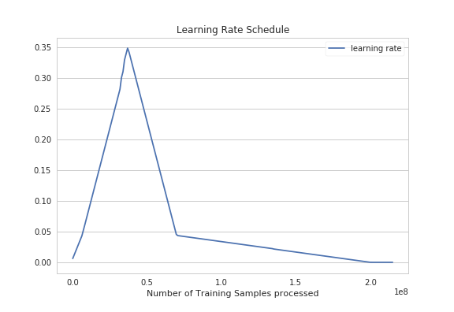
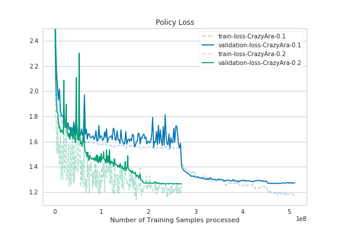
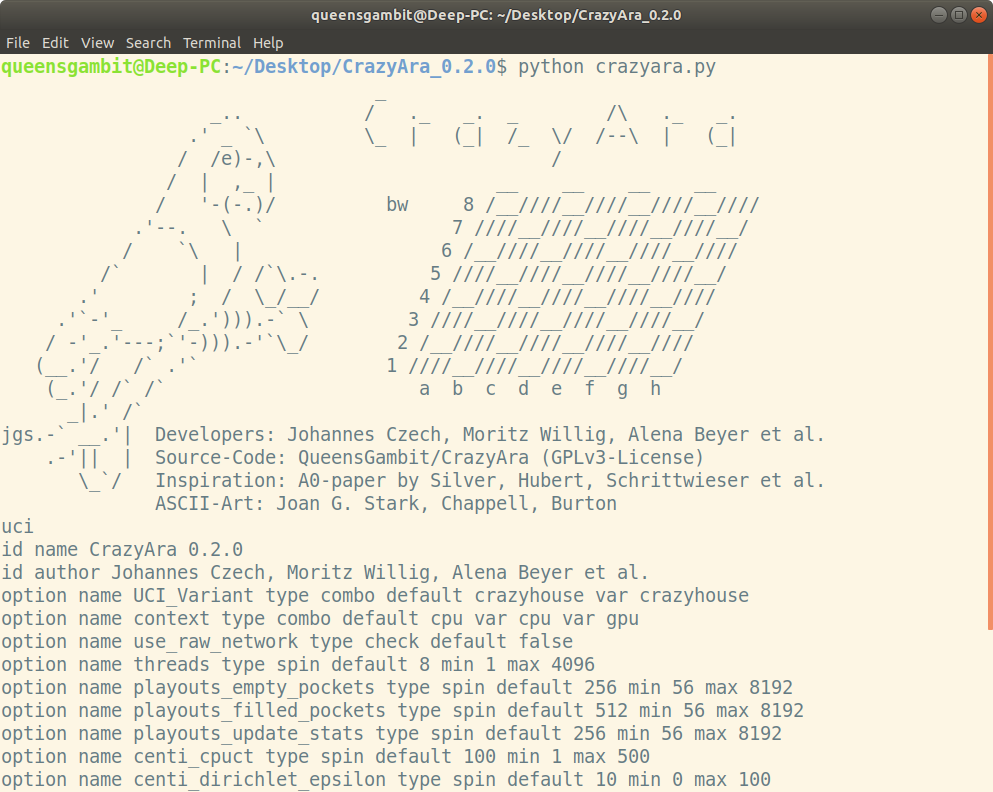
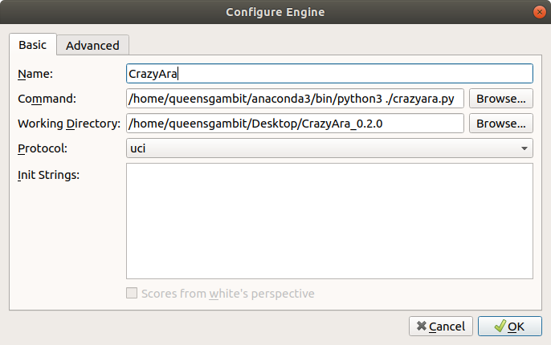
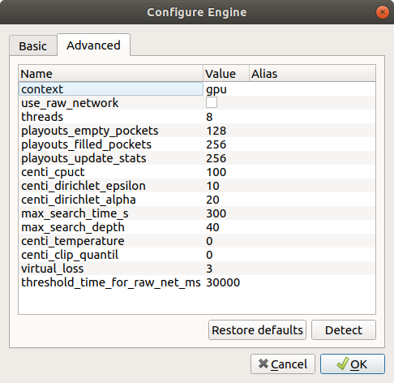
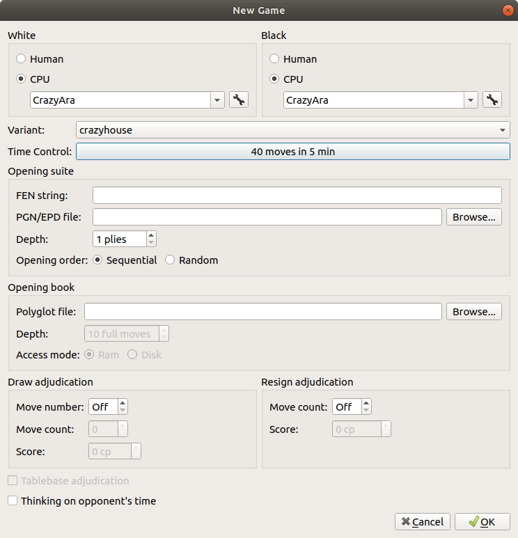

Home
----

We're happy to announce the official first release of CrazyAra.

There were several changes compared to CrazyAra 0.1 the version which went live September 7, 20:00 hrs to September 9, 14:30 hrs. (Central European Time)

The following wiki-pages give you a brief overview of the input, output-representation, training-process and an evaluation of CrazyAra's  current strength.

 
Input representation
---------------------

The overall input representaiton can be seen as a hybrid between chess and shogi compared to to the 

Changes for both CrazyAra 0.1 and CrazyAra 0.2:
-> the main difference is the avoidance of a history representatin.

This has several motivations:
* Crazyhouse, as well as chess is a full information game. In theory the history isn't needed to find the best possible move.
* The avoidance of the history allows better compatibility as an analysis uci engine.
Otherwise one would have to add dummy layers which will distort the network predictions.
* Avoiding the history reduces model parameters, storage for saving the dataset and allows higher batch-sizes during training
* The en-passent capture possibility has been included in the input representation as an additional layer 
-> this allows fen-conversion capability while maintaining a small input shape.
* Deep Mind mentioned that the history acts as an attention mechanism.
If one is interested in this attention mechanism one could also only highlight only the last move squares.

Overview of the full input-plane representation:

### Crazyhouse

| Feature | Planes | Comment |
|---|:---:|:---|
|P1 piece | 6 | pieces are ordered: PAWN, KNIGHT, BISHOP, ROOK, QUEEN, KING
|P2 piece | 6 | pieces are ordered: PAWN, KNIGHT, BISHOP, ROOK, QUEEN, KING
|Repetitions | 2 | two planes (full zeros/ones) indicating how often the board positions has occurred
|P1 prisoner count | 5 | pieces are ordered: PAWN, KNIGHT, BISHOP, ROOK, QUEEN) (excluding the KING)
|P2 prisoner count | 5 | pieces are ordered: PAWN, KNIGHT, BISHOP, ROOK, QUEEN) (excluding the KING)
|P1 Promoted Pawns Mask | 1 | binary map indicating the pieces which have been promoted
|P2 Promoted Pawns Mask | 1 | binary map indicating the pieces which have been promoted
|En-passant square | 1 | Binary map indicating the square where en-passant capture is possible
|Colour | 1 | all zeros for black and all ones for white|
|Total move count | 1 | integer value setting the move count (uci notation))
|P1 castling | 2 | One if castling is possible, else zero
|P2 castling | 2 | One if castling is possible, else zero
|No-progress count | 1 | Setting the no progress counter as integer values, (described by uci halfmoves format)
---
The history list of the past 7 board states have been removed

The total number of planes is calculated as follows:

**27 + 7 = 34 planes total** 

    
* All Input planes are scaled to the linear range of [0.,1].

For this several constants are introduced `MAX_NB_PRISONERS`, `MAX_NB_MOVES`, `MAX_NB_NO_PROGRESS`. See `crazyhouse/constants.py` for more details.

This was essential when training with Stochastic Gradient Descent.
The Adam optimizer could handle un-normalized input features better, but converged overall to a worse local minimum compared to SGD Nesetrov Momentum on normalized features.


Output representation
---------------------

CrazyAra 0.1 used a simliar policy encoding as AlphaZero:
Using semantic planes for each compass directions, special planes for knight moves, etc.
The old policy description had two minor disadvantages:
1. The total flattened policy vector had 4992 entries of which more than half of the entries are illegal moves. 
This is due to the fact that you can't access the region out of the board if the piece is located at the edge.
Generally it should be avoided to train a neural net with classes that never occurred and will occur in the dataset.
2. Alpha-Zero's output description does only represent promoting to minor pieces treating promoting to queen as default.
This leads to am ambiguity when converting the move to uci-notation because `e7e8` and `e7e8q` are seen as two different moves.

CrazyAra 0.2 uses a more compact policy representation.
It makes uses of a constant vector which stores all possible uci-moves in any given Crazyhouse-Board-State.
Most of these entries are traditional chess moves. At the end of the vector all possible dropping moves have been added.
This vector has only 2272 entries.


Supervised Training
-------------------

* CrazyAra 0.1 used a similar training schedule as Alpha-Zero:

 Using a constant learning rate 0.1 and dropping by factor 10 when no improvement was made on the validation dataset for a given period.
* CrazyAra 0.2 uses a One-Cycle-Policy Learning rate schedule combined with a momentum schedule.
The learning rate was determined using a lr-range test.

|             |                                       |
:-------------------------:|:-------------------------:
  |  

### Referenes
* Smith and Topin - 2017 - **Super-Convergence Very Fast Training of Neural Networks Using  Large Learning Rates** - https://arxiv.org/pdf/1708.07120.pdf_
* Smith - 2018 - **A disciplined approach to neural network hyper-pararameters** - https://arxiv.org/pdf/1803.09820.pdf


Model Architecture
------------------

In CrazyAra v0.2.0 a newly designed architecture was used which is called **RISE** for short.

It incorporates new ideas and techniques described in recent papers for Deep Learning in Computer Vision.

| | | 
|:--------|:-------|
| **R**esneXt      | He et al. - 2015 - Deep Residual Learning for Image Recognition.pdf - https://arxiv.org/pdf/1512.03385.pdf
|            | Xie et al. - 2016 - Aggregated Residual Transformations for Deep Neurarl Networks - http://arxiv.org/abs/1611.05431|
| **I**nception | Szegedy et al. - 2015 - Rethinking the Inception Architecture for ComputerVision - https://arxiv.org/pdf/1512.00567.pdf)
|       | Szegedy et al. - 2016 - Inception-v4, Inception-ResNet and the Impact of Residual Connections on Learning - https://arxiv.org/pdf/1602.07261.pdf)|
| **S**queeze | Hu et al. - 2017 - Squeeze-and-Excitation Networks - https://arxiv.org/pdf/1709.01507.pdf)|
| **E**xcitation | Hu et al. - 2017 - Squeeze-and-Excitation Networks - https://arxiv.org/pdf/1709.01507.pdf)|

The proposed model architecture has fewer parameters, faster inference and training time while maintaining an equal amount of depth
compared to the architecture proposed by DeepMind (19 residual layers with 256 filters).
On our 10,000 games benchmark dataset it achieved a lower validation error using the same learnig rate and optimizer settings.

| RISE-Architecture (CrazyAra v0.2)            |  Vanilla-Resnet Architecture(CrazyAra v0.1)                                     |
:-------------------------:|:-------------------------:
  |  


Training Results:
-----------------

The deeper model using 7 standard residual blocks and 12 bottleneck residual blocks was trained only supervised using the same training and validation dataset:
* **569,537 human games** generated by **lichess.org** users from **January 2016** to **June 2018** (database.lichess.org/) in which both players had an **elo >= 2000**. 

|             |                                       |
:-------------------------:|:-------------------------:
  |  
  |  

As it can bee seen in the graphs the deeper model converged quicker.
Despite using half of the batch-size and having a deeper model the full training time was reduced from previously **~40 hours** to **~36,5 hours**.


Strength Evaluation
-------------------


Hardware Setup:
* Memory (RAM): 31,4 GiB
* Processor - AMD® Ryzen 7 1700 eight-core processor × 16 
* Graphics - GeForce GTX 1080 Ti/PCIe/SSE2
* OS type - 64-bit

The various Alpha-Beta engines achieved a Node per Seconds of ~700,000-2,000,00.

CrazyAra v0.2.0 using MCTS had a Node per Seconds of 30-70 using both CPU and GPU.

### Result Overview

All these matches have been conducted using 5min/40 moves time control.

Hyperparameter Settings for MCTS:
* threads - 8
* cpuct - 1
* playouts_empty_pockets - 256
* playouts_filled_pockets - 512
* playouts_update_stats - 256
* max_search_depth - 40
* max_search_time_s - 30
* dirichlet_alpha - 0.2
* dirichlet_epsilon - 0.1
* threshold_time_for_raw_net_ms - 30,000

All these engines

 | Engine Name | Estimated Elo  | Link
 :-------------------------:|:-------------------------:|:-------------------------:
|Sjeng 11.2 |  2300 | https://github.com/gcp/sjeng, https://sjeng.org/download.html
| Crazywa 0.1.1 | 2349.11 | http://computer-chess.org/doku.php?id=computer_chess:wiki:lists:variants_engine_list
| SjaakII 1.4.1 | 2353.87 | sudo apt-get install sjaakii, http://www.chess2u.com/t5010-sjaak
| Sunsetter 8 | 2703.39 | https://sourceforge.net/projects/sunsetter/files/latest/download
| Stockfish 2018-10-13 | 3946.06 | https://github.com/ddugovic/Stockfish |

_The elo estimates are taken from according to this tournament_:
 https://lichess.org/forum/team-crazyhouse-engine-development-and-game-analyses/swiss-crazyhouse-tournament?page=3


| WHITE            |    BLACK                 |    WINNER |
:-------------------------:|:-------------------------:|:-------------------------:
| Sjeng 11.2 | CrazyAra 0.2 | CrazyAra 0.2
| CrazyAra 0.2 | Sjeng 11.2 | CrazyAra 0.2
| Crazywa 0.1.1 | CrazyAra 0.2 | CrazyAra 0.2
| CrazyAra 0.2 | Crazywa 0.1.1 | CrazyAra 0.2
| SjaakII 1.4.1 | CrazyAra 0.2 | CrazyAra 0.2
| CrazyAra 0.2 | SjaakII 1.4.1 | CrazyAra 0.2
| Sunsetter 8 | CrazyAra 0.2 | Sunsetter 8
| CrazyAra 0.2 | Sunsetter 8 | Sunsetter 8
| CrazyAra 0.2 | Sunsetter 8 | CrazyAra 0.2
| Stockfish 2018-10-13 | CrazyAra 0.2 | Stockfish 2018-10-13
| CrazyAra 0.2 | Stockfish 2018-10-13  | Stockfish 2018-10-13

### Some Example Games

##### Reading the PGN-Annotations:
1. e3 {+0.80/10 6.5s} -> {MV_NUMBER}  {SCORE}/{DEPTH} {ELAPSED_TIME}

* Sjeng - CrazyAra
```
[Date "2018.10.21"]
[White "sjeng"]
[Black "CrazyAra"]
[Result "0-1"]
[PlyCount "52"]
[TimeControl "40/300"]
[Variant "crazyhouse"]

1. e3 {+0.80/10 6.5s} Nf6 {+0.01/7 4.5s} 2. Bc4 {-0.20/9 5.9s} d5 {-1.52/7 3.9s}
3. Bb5+ {-0.47/9 12s} Bd7 {-1.67/8 4.2s} 4. Bxd7+ {-0.48/9 15s}
Nbxd7 {-2.84/8 12s} 5. Nc3 {-0.43/9 6.6s} e5 {-2.66/6 9.2s}
6. Qe2 {-0.88/8 6.5s} Bb4 {-4.13/5 9.3s} 7. B@g5 {-1.07/8 6.5s}
O-O {-2.21/7 8.7s} 8. Nxd5 {+1.03/9 5.6s} Nxd5 {-3.56/8 13s}
9. Bxd8 {+1.47/8 5.3s} Raxd8 {-3.38/6 12s} 10. P@c4 {+1.09/8 8.0s}
N5f6 {-6.54/7 9.9s} 11. Q@b5 {+0.67/9 6.9s} B@c6 {-10.20/7 8.9s}
12. Qxb4 {+2.22/10 6.6s} Bxg2 {-9.40/6 10.0s} 13. B@f3 {+2.22/9 6.5s}
Bxf3 {-10.27/6 9.7s} 14. Nxf3 {+3.06/9 6.5s} e4 {-9.21/6 9.8s}
15. Qxb7 {+1.95/8 6.5s} exf3 {-9.83/7 11s} 16. Qexf3 {+1.97/8 6.5s}
B@g4 {-11.38/4 11s} 17. Qxg4 {+1.01/8 6.5s} Nxg4 {-7.91/6 12s}
18. P@e7 {+0.01/6 9.7s} P@e2 {-15.26/6 11s} 19. Kxe2 {+1.44/6 16s}
N@f4+ {-13.88/11 9.4s} 20. exf4 {-M11/6 9.9s} N@d4+ {-14.25/13 9.7s}
21. Kf1 {-M9/7 8.9s} Q@e2+ {-21.59/11 9.2s} 22. Kg2 {-M11/6 7.2s}
Qxf2+ {-18.34/11 9.8s} 23. Kh3 B@g2+ {-18.11/8 9.4s} 24. Qxg2 {-M7/7 6.7s}
Qxg2+ {-25.34/13 6.8s} 25. Kxg2 {-M5/7 6.5s} Q@f3+ {-52.54/11 10s} 26. Kg1
Ne2# {-M1/1 0.46s, Black mates} 0-1
```

* CrazyAra - CrazyWa
```
[Date "2018.10.21"]
[White "CrazyAra"]
[Black "crazywa"]
[Result "1-0"]
[PlyCount "63"]
[TimeControl "40/300"]
[Variant "crazyhouse"]

1. e4 {+1.18/9 4.2s} d5 {-0.33/11 4.7s} 2. exd5 {+1.53/8 4.3s}
Qxd5 {-0.61/11 9.6s} 3. Nc3 {+1.71/10 11s} Qe6+ {-0.64/9 6.5s}
4. Be2 {+2.38/10 11s} Nf6 {-0.83/10 24s} 5. d4 {+3.01/9 10s} Qf5 {-0.78/9 6.4s}
6. Nf3 {+2.95/8 9.6s} Qg4 {-0.86/9 5.2s} 7. Rg1 {+3.67/10 9.6s}
Nc6 {-1.15/9 7.0s} 8. d5 {+5.87/7 9.1s} Nb4 {-1.26/9 5.0s} 9. a3 {+7.99/8 11s}
Na6 {-2.07/9 5.0s} 10. Ne5 {+9.92/6 9.1s} Qh4 {-2.60/10 7.6s}
11. Bxa6 {+8.62/9 9.8s} bxa6 {-3.00/9 8.2s} 12. N@f3 {+8.70/6 10s}
Qh5 {-3.87/9 5.4s} 13. Nxf7 {+9.65/8 9.7s} P@e2 {-6.13/9 9.9s}
14. Qxe2 {+13.53/10 11s} Qxf7 {-10.72/10 16s} 15. P@e6 {+15.36/7 9.9s}
Qh5 {-9.06/9 5.5s} 16. P@d7+ {+11.90/6 10s} Bxd7 {-6.62/9 8.0s}
17. exd7+ {+13.21/6 11s} Kd8 {-7.50/8 6.2s} 18. B@c6 {+14.69/4 9.8s}
P@b7 {-9.43/8 25s} 19. Bxb7 {+15.52/4 8.8s} Rb8 {-8.61/8 4.2s}
20. Ne5 {+15.73/3 9.2s} Qxe5 {-27.03/8 5.6s} 21. Qxe5 {+16.21/6 9.5s}
B@d2+ {-M14/9 5.7s} 22. Bxd2 {+22.99/6 12s} Nxd7 {-M12/9 5.8s}
23. B@c6 {+23.21/5 10s} N@d3+ {-M18/7 7.4s} 24. cxd3 {+26.56/9 11s}
N@c2+ {-M12/13 4.8s} 25. Kf1 {+28.96/11 11s} P@e2+ {-M10/16 3.4s}
26. Nxe2 {+32.27/10 9.3s} Ne3+ {-M8/98 2.1s} 27. Bxe3 {+38.56/8 7.9s}
Rxb7 {-M6/98 0.80s} 28. N@e6+ {+38.84/7 9.5s} Ke8 {-M4/15 0.086s}
29. Bxd7+ {+41.71/7 9.3s} Kf7 {-M4/8 0.010s} 30. Ng5+ {+47.65/5 9.0s}
Kg6 {-M4/8 0.009s} 31. Q@f7+ {+50.43/4 9.2s} Kh6 {-M2/3 0.004s}
32. N@g4# {+M1/1 0.45s, White mates} 1-0

```

* SjakII - CazyAra
```
[Date "2018.10.21"]
[White "sjaakii"]
[Black "CrazyAra"]
[Result "0-1"]
[PlyCount "82"]
[TimeControl "40/300"]
[Variant "crazyhouse"]

1. Nf3 {+0.14/13 7.0s} Nf6 {+0.35/9 4.5s} 2. d4 {+0.14/12 4.2s}
d5 {+0.33/7 4.1s} 3. Bf4 {+0.15/11 3.9s} Bf5 {+0.31/8 4.5s}
4. e3 {+0.11/11 7.4s} e6 {+0.67/8 4.2s} 5. Bb5+ {+0.11/9 4.9s}
Nbd7 {+0.49/10 5.4s} 6. O-O {+0.14/10 4.4s} Bd6 {-0.14/10 4.6s}
7. Ne5 {+0.06/10 5.8s} O-O {+0.04/9 4.5s} 8. Bxd7 {+0.73/10 5.0s}
Nxd7 {-2.15/11 14s} 9. N@h6+ {+0.23/10 7.2s} gxh6 {-2.82/11 16s}
10. Nxd7 {+0.80/10 11s} B@g7 {-3.33/12 12s} 11. Bxd6 {+1.07/9 4.5s}
cxd6 {-4.40/10 14s} 12. Nxf8 {+1.14/9 5.8s} Qxf8 {-6.71/6 12s}
13. Nc3 {+1.11/9 7.5s} N@h4 {-7.39/5 11s} 14. Qh5 {+1.83/9 8.2s}
Nxg2 {-10.28/5 12s} 15. Nxd5 {+1.16/8 7.9s} exd5 {-11.16/4 12s}
16. Qxf5 {+0.91/9 8.2s} Nh4 {-16.36/5 12s} 17. N@f6+ {-2.34/8 7.3s}
Bxf6 {-13.54/8 15s} 18. Qg4+ {-2.71/8 8.3s} Qg7 {-17.66/4 13s}
19. Qxg7+ {-2.87/7 4.2s} Bxg7 {-19.40/10 17s} 20. Q@h3 {-5.48/8 8.2s}
N@f3+ {-18.64/7 13s} 21. Kh1 {-7.58/9 8.4s} P@g2+ {-12.70/6 13s}
22. Qxg2 {-4.33/2 0.001s} Nxg2 {-12.39/4 12s} 23. R@g3 {-7.32/8 4.7s}
Ngh4 {-11.49/2 11s} 24. P@g2 {-8.02/9 6.7s} N@e4 {-12.56/3 12s}
25. Rxf3 {-10.52/9 9.0s} Nxf3 {-15.55/3 12s} 26. B@g1 {-10.90/8 5.4s}
Nxg1 {-16.47/3 13s} 27. N@f4 {-11.23/8 5.8s} B@f3 {+12.70/1 0.037s}
28. Kxg1 {-10.85/9 9.9s} Bxg2 {+16.66/1 0.026s} 29. B@h1 {-12.84/8 9.9s}
Bxh1 {+20.97/1 0.036s} 30. P@g6 {-14.87/8 9.9s} hxg6 {+22.57/1 0.035s}
31. N@e7+ {-18.18/8 10.0s} Kh7 {+19.34/1 0.027s} 32. Kxh1 {-M10/8 14s}
B@f3+ {+18.90/1 0.026s} 33. B@g2 {-M10/7 3.9s} Bxg2+ {+17.85/1 0.027s}
34. Nxg2 {-M8/5 0.24s} B@f3 {+24.28/1 0.029s} 35. B@h3 {-18.39/8 12s}
P@g4 {+20.13/1 0.023s} 36. Nxd5 {-M8/8 7.6s} gxh3 {+23.43/1 0.038s}
37. Nf4 {-M6/5 0.23s} hxg2+ {+26.58/1 0.039s} 38. Nxg2 {-M8/4 0.10s}
Bxg2+ {+31.69/1 0.032s} 39. Kxg2 {-M6/3 0.024s} N@h4+ {+31.08/1 0.037s}
40. Kh3 {-M4/2 0.001s} Q@g2+ {+31.30/1 0.033s} 41. Kxh4 {-M2/2 0s}
N@f3# {-M1/1 0.42s, Black mates} 0-1
```

* Sunsetter - CrazyAra
```
[Date "2018.10.21"]
[White "sunsetter"]
[Black "CrazyAra"]
[Result "1-0"]
[PlyCount "135"]
[TimeControl "40/300"]
[Variant "crazyhouse"]

1. e4 {+0.13/15 7.5s} e5 {+0.26/10 4.4s} 2. Nf3 {+0.14/14 7.4s}
Nc6 {+0.67/13 4.3s} 3. Nc3 {+0.10/14 7.3s} Nf6 {+0.79/13 4.5s}
4. d3 {+0.07/14 7.2s} Be7 {-0.34/11 4.4s} 5. Bg5 {+0.24/14 7.2s}
O-O {-0.50/9 4.5s} 6. Bxf6 {+0.53/14 7.1s} Bxf6 {-0.62/13 12s}
7. Nd5 {+0.52/13 7.0s} d6 {-0.50/11 11s} 8. Nxf6+ {+0.54/13 6.9s}
Qxf6 {+0.03/12 15s} 9. B@g5 {+0.54/13 6.8s} Qg6 {-0.28/11 13s}
10. N@d5 {+0.58/12 6.7s} Bg4 {-0.98/7 9.3s} 11. Bd2 {+0.31/13 13s}
Bxf3 {-4.35/9 9.6s} 12. Qxf3 {+0.21/12 6.5s} N@d4 {-4.80/10 12s}
13. Qd1 {-0.61/12 6.4s} B@h5 {-6.78/10 11s} 14. Qc1 {-0.83/11 6.3s}
N@f3+ {-7.96/11 10s} 15. gxf3 {-0.93/13 6.2s} Nxf3+ {-10.26/12 13s}
16. Kd1 {-0.93/12 6.2s} P@g2 {-12.66/10 10s} 17. N@e7+ {-0.28/13 24s}
Nxe7 {-8.96/22 17s} 18. Nxe7+ {-0.28/13 5.8s} Kh8 {0.00/1 0.058s}
19. Nxg6+ {-0.28/13 5.7s} fxg6 {-8.17/20 14s} 20. Bxg2 {-0.18/12 5.6s}
Nxd2+ {-7.41/18 13s} 21. P@e2 {-0.14/11 5.5s} Bxe2+ {-7.16/13 12s}
22. Kxd2 {-0.14/11 5.5s} Rxf2 {-11.18/6 11s} 23. B@e3 {-0.16/11 22s}
B@g5 {-8.38/7 9.9s} 24. N@f7+ {+0.55/11 5.1s} Rxf7 {-5.32/9 15s}
25. Bxg5 {+0.05/12 5.1s} N@d4 {-5.80/5 12s} 26. N@h4 {+0.63/11 10s}
P@f4 {-6.51/5 11s} 27. B@g1 {-0.22/12 39s} P@e3+ {-9.02/9 11s}
28. Bxe3 {-0.69/12 4.4s} fxe3+ {+10.23/1 0.024s} 29. Bxe3 {-0.69/11 4.4s}
B@f4 {+2.55/1 0.027s} 30. Bxf4 {-1.42/11 17s} exf4 {+5.14/1 0.027s}
31. P@f2 {-0.82/11 8.1s} B@g5 {+6.27/1 0.028s} 32. Q@d5 {+0.69/10 0.69s}
Bxh4 {+3.50/1 0.028s} 33. B@c3 {+0.04/9 0.34s} N@f3+ {+4.65/1 0.023s} 34. Bxf3
Nxf3+ {+7.45/1 0.032s} 35. Kxe2 N@d4+ {+1.03/1 0.028s} 36. Bxd4 {+1.18/10 0.33s}
Nxd4+ {+0.91/1 0.025s} 37. Qxd4 {+0.56/9 0.33s} f3+ {+4.41/1 0.022s}
38. Kd1 {+1.71/10 0.62s} B@e2+ {+2.78/1 0.025s} 39. Kd2 {+1.56/10 0.31s}
B@e5 {+1.89/1 0.023s} 40. Qe3 {+0.67/10 0.60s} Bf4 {+4.04/1 0.028s}
41. Qxf4 {+0.86/12 7.7s} Rxf4 {-1.83/10 15s} 42. B@d4 {+0.86/11 7.6s}
N@e6 {-0.77/9 14s} 43. N@h3 {+1.06/11 15s} Nxd4 {-2.08/8 15s}
44. Nxf4 {+0.98/11 7.3s} B@f7 {-2.48/7 15s} 45. B@e3 {+2.19/12 29s}
Bf6 {-1.51/7 15s} 46. P@e7 {+2.52/11 6.8s} Bxe7 {-1.89/7 14s}
47. Bxd4 {+2.45/11 6.8s} P@e5 {-2.11/10 15s} 48. Nxe2 {+2.62/11 6.7s}
fxe2 {-6.25/7 14s} 49. Be3 {+2.45/11 6.6s} N@d4 {-3.55/6 14s}
50. R@d7 {+3.42/11 6.5s} Nf3+ {-3.55/8 14s} 51. Kxe2 {+3.73/13 6.4s}
Q@g4 {-2.10/14 18s} 52. Rxe7 {+3.75/12 6.4s} Nxh2+ {-0.23/16 18s}
53. Kd2 {+3.02/13 13s} Nf3+ {-1.84/17 24s} 54. Kc3 {+3.25/13 6.1s}
P@d4+ {-2.07/14 24s} 55. Kb4 {+2.02/12 12s} a5+ {-2.45/15 22s}
56. Ka3 {+2.82/12 5.9s} dxe3 {-2.72/11 19s} 57. Rxf7 {+2.27/10 5.8s}
Qe6 {-3.45/10 16s} 58. Rxc7 {+2.48/11 46s} b5 {-6.10/10 15s}
59. c3 {+3.73/11 41s} b4+ {+3.64/1 0.025s} 60. Ka4 {+4.38/10 4.7s}
B@d7+ {-0.50/1 0.034s} 61. P@c6 {+5.59/10 4.6s} Bxc6+ {-2.23/1 0.020s}
62. Rxc6 {+5.65/11 4.6s} P@b5+ {-2.85/1 0.014s} 63. Kxb5 Qd7 {-5.18/1 0.027s}
64. N@b6 {+9.30/10 4.5s} Qb7 {-3.71/1 0.014s} 65. B@c8 {+12.08/10 4.4s}
Qa6+ {-5.49/1 0.014s} 66. Bxa6 {+29.35/10 4.4s} Rxa6 {-10.75/1 0.014s} 67. Q@f8+
B@g8 {-23.96/1 0.022s} 68. N@f7# {White mates} 1-0
```

* CrazyAra - Sunsetter
```
[Date "2018.10.22"]
[White "CrazyAra"]
[Black "sunsetter"]
[Result "1-0"]
[PlyCount "85"]
[TimeControl "40/300"]
[Variant "crazyhouse"]

1. e4 {+1.17/9 4.2s} e5 {+0.17/15 7.5s} 2. Nf3 {+1.00/13 4.2s}
Nc6 {+0.13/14 7.4s} 3. Bc4 {+1.06/13 4.5s} Nf6 {+0.12/13 7.3s}
4. Ng5 {+2.92/9 4.1s} d5 {+0.75/13 7.3s} 5. exd5 {+2.04/11 5.3s}
Na5 {+0.83/13 7.2s} 6. Nxf7 {+3.01/12 11s} Kxf7 {-0.17/12 7.1s}
7. P@e6+ {+2.45/9 10s} Ke7 {+0.05/13 7.0s} 8. d3 {+3.20/11 10s}
Nxc4 {-0.60/12 6.9s} 9. dxc4 {+3.81/10 13s} Bxe6 {-0.43/11 6.8s}
10. Bg5 {+3.25/9 11s} N@e4 {-0.72/10 6.7s} 11. Bxf6+ {+2.28/9 11s}
gxf6 {-0.38/11 6.6s} 12. dxe6 {+2.80/8 11s} Qxd1+ {-0.85/10 6.5s}
13. Kxd1 {-0.43/1 0.026s} Rd8+ {-0.86/9 6.5s} 14. B@d5 {+0.44/8 12s}
B@h5+ {+1.04/10 102s} 15. P@f3 {+2.43/10 13s} Nxf2+ {+0.14/11 41s}
16. Ke2 {+1.08/10 14s} Rxd5 {+0.14/10 4.6s} 17. N@e3 {+4.63/7 11s}
Q@e4 {+0.01/11 18s} 18. N@f5+ {+5.05/12 11s} Kd8 {+2.12/11 8.6s}
19. cxd5 {+8.26/10 12s} B@b5+ {+1.95/11 17s} 20. Kxf2 {+6.00/15 17s}
Qxe3+ {+2.38/10 0.76s} 21. Nxe3 {+5.89/18 19s} B@h4+ {+3.88/10 1.4s}
22. g3 {+7.09/19 15s} N@h3+ {+3.21/10 1.3s} 23. Kg2 {+8.76/10 14s}
Nf4+ {+3.24/10 2.4s} 24. gxf4 {+10.25/9 15s} Bxf3+ {+11.70/10 4.0s}
25. Kxf3 {+15.89/7 16s} P@g4+ {+11.13/10 0.70s} 26. Kxg4 {+16.36/8 16s}
h5+ {+8.36/9 0.19s} 27. Kxh4 {+6.08/1 0.020s} P@g5+ {+8.70/10 0.17s}
28. fxg5 {+10.37/1 0.036s} fxg5+ {+9.32/9 0.15s} 29. Kxg5 {+10.31/1 0.017s}
Bh6+ {+9.46/8 0.15s} 30. Kh4 {+6.37/1 0.026s} P@g5+ {+9.74/9 0.15s}
31. Kxh5 {+10.05/1 0.027s} Bf8+ {+11.13/9 0.57s} 32. Kxg5 {+11.67/1 0.021s}
Bh6+ {+11.72/9 0.15s} 33. Kg4 {+10.50/1 0.020s} P@h5+ {+14.47/9 0.53s}
34. Kxh5 {+11.06/1 0.018s} Bxe3+ {+8.59/8 0.24s} 35. Kg4 {+6.05/1 0.023s}
Rg8+ {+7.72/9 0.89s} 36. Kf3 {+4.16/1 0.018s} Rf8+ {+10.74/9 0.21s}
37. P@f7 {+6.14/1 0.015s} N@d4+ {+13.01/9 0.36s} 38. Kxe3 {+10.65/1 0.030s}
Nf5+ {+13.52/9 0.17s} 39. Ke4 {+16.29/1 0.025s} Nd6+ {+14.78/9 0.20s}
40. Kxe5 {+15.66/1 0.025s} Nxf7+ {+17.96/9 0.21s} 41. exf7 {+21.93/6 16s}
Rxf7 {+M6/9 7.2s} 42. N@e6+ {+39.96/3 8.3s} Kc8
43. Q@d8# {+M1/1 0.55s, White mates} 1-0
```

* Stockfish - CrazyAra
```
[Date "2018.10.21"]
[White "stockfish-x86_64-modern  2018-10-13"]
[Black "CrazyAra"]
[Result "1-0"]
[PlyCount "53"]
[TimeControl "40/300"]
[Variant "crazyhouse"]

1. e4 {+1.41/24 19s} e6 {+0.26/10 4.5s} 2. d4 {+2.48/20 5.3s} d5 {+0.17/11 4.3s}
3. e5 {+2.64/20 1.9s} Nc6 {+0.06/8 4.1s} 4. Nf3 {+2.75/20 3.8s}
Nge7 {-0.33/8 3.7s} 5. Nc3 {+3.19/21 11s} Nf5 {-1.00/9 4.5s}
6. Bg5 {+3.04/21 6.1s} Be7 {-2.37/8 4.6s} 7. Bxe7 {+3.36/20 4.8s}
Qxe7 {-0.98/11 14s} 8. B@c5 {+3.79/20 13s} Qd8 {-0.43/12 11s}
9. Bd3 {+3.88/20 5.7s} B@g4 {-1.15/11 11s} 10. Bxf5 {+4.06/18 2.7s}
exf5 {+0.19/13 14s} 11. h3 {+5.65/18 3.3s} Bxf3 {+0.83/14 13s}
12. Qxf3 {+5.62/18 4.3s} B@e4 {+0.06/8 13s} 13. Qg3 {+8.92/18 2.3s}
N@h5 {+3.90/9 14s} 14. Qxg7 {+9.22/19 8.9s} Nxg7 {+5.17/11 19s}
15. B@f6 {+9.93/17 3.3s} Qxf6 {+3.40/7 13s} 16. exf6 {+11.50/18 3.5s}
B@h4 {+0.56/13 13s} 17. fxg7 {+18.52/18 2.5s} Bxf2+ {+1.86/14 12s}
18. Kxf2 {+21.96/18 3.7s} P@g3+ {+3.75/9 11s} 19. Kxg3 {+25.85/18 14s}
f4+ {+4.51/10 11s} 20. Kxf4 {+26.08/18 13s} Q@h6+ {+4.24/9 12s}
21. P@g5 {+25.88/18 14s} Qxg7 {+6.74/8 12s} 22. N@f6+ {+26.64/16 7.3s}
Qxf6+ {+8.54/11 16s} 23. gxf6 {+27.88/16 1.7s} N@f5 {+3.68/7 11s}
24. P@g7 {+M15/20 7.1s} Rg8 {+9.49/6 11s} 25. Q@f8+ {+M5/51 2.0s}
Rxf8 {+38.67/4 7.5s} 26. gxf8=Q+ {+M3/109 4.4s} Kd7 {+M1/1 0.053s}
27. Q@e8# {+M1/127 0.026s, White mates} 1-0
```


### Raw Network
* In this experiment no mcts-search was used but the legal move with the highest softmax activation using a single network prediction:


```
[Date "2018.10.21"]
[White "CrazyAra"]
[Black "crazywa"]
[Result "0-1"]
[PlyCount "74"]
[TimeControl "40/120"]
[Variant "crazyhouse"]

1. e4 {+0.71/1 0.25s} d5 {-0.48/10 2.0s} 2. exd5 {+0.83/1 0.022s}
Qxd5 {-0.44/10 3.5s} 3. Nc3 {+0.76/1 0.023s} Qe5+ {-0.62/8 1.7s}
4. Be2 {+0.20/1 0.026s} Qg5 {-0.62/9 4.8s} 5. Bf3 {+1.95/1 0.031s}
Qa5 {-0.75/7 1.8s} 6. Nge2 {+2.04/1 0.019s} Nf6 {-0.60/9 3.3s}
7. O-O {+1.61/1 0.023s} e6 {-0.42/9 2.7s} 8. d4 {+2.07/1 0.025s}
Bb4 {-0.56/9 3.1s} 9. a3 {+2.99/1 0.020s} Be7 {-0.58/9 6.6s}
10. b4 {+4.19/1 0.021s} Bxb4 {+1.47/10 2.1s} 11. axb4 {+5.41/1 0.015s}
Qxa1 {+2.09/9 2.5s} 12. B@b2 {+3.44/1 0.015s} Qa6 {+3.13/9 2.1s}
13. b5 {+4.13/1 0.018s} Qa5 {+3.29/9 2.3s} 14. Bg5 {+3.87/1 0.025s}
R@f5 {+3.36/8 2.3s} 15. Bxf6 {+2.85/1 0.025s} Rxf6 {+1.60/9 3.3s}
16. N@h5 {+6.92/1 0.029s} Rg6 {+2.08/9 2.3s} 17. Nef4 {+3.02/1 0.028s}
Rg5 {+1.36/8 4.7s} 18. Ne4 {+5.57/1 0.017s} Qxb5 {+1.37/8 3.1s}
19. Nxg5 {+5.57/1 0.013s} Qxg5 {+1.09/8 5.9s} 20. R@g3 {+6.20/1 0.020s}
Qh4 {+0.46/7 1.8s} 21. Nxg7+ {+12.76/1 0.019s} Kd8 {-1.98/8 1.6s}
22. d5 {+9.77/1 0.025s} e5 {-3.07/7 2.9s} 23. Bxe5 {+14.86/1 0.024s}
P@d6 {-7.20/8 12s} 24. P@e7+ {+13.77/1 0.022s} Qxe7 {-5.33/9 4.3s}
25. P@f6 {+11.43/1 0.015s} Qxe5 {-7.77/9 2.7s} 26. P@e7+ {+5.30/1 0.018s}
Kd7 {-7.78/8 1.3s} 27. Bg4+ {+7.29/1 0.028s} P@f5 {-8.49/8 7.1s}
28. Bxf5+ {+9.59/1 0.027s} P@e6 {-8.44/7 1.7s} 29. dxe6+ {+12.27/1 0.030s}
Kc6 {-13.61/7 4.9s} 30. Qd5+ {+10.27/1 0.024s} Qxd5 {-4.52/7 0.92s}
31. Nxd5 {+11.44/1 0.024s} N@e2+ {-6.50/7 3.7s} 32. Kh1 {+4.73/1 0.020s}
Q@b5 {-6.51/6 2.2s} 33. P@d7 {+5.73/1 0.019s} Nxg3+ {+M15/6 0.80s}
34. hxg3 {+6.06/1 0.016s} Qxf1+ {+M13/6 1.1s} 35. N@g1 {-2.74/1 0.019s}
Qxg1+ {+M11/6 1.9s} 36. Kxg1 {-2.86/1 0.024s} R@d1+ {+M9/6 0.81s}
37. Kh2 {-4.96/1 0.018s} R@h1# {+M1/3 0.007s, Black mates} 0-1
```
---

```
[Date "2018.10.21"]
[White "CrazyAra"]
[Black "sjeng"]
[Result "1-0"]
[PlyCount "61"]
[TimeControl "40/120"]
[Variant "crazyhouse"]

1. e4 {+0.71/1 0.27s} g6 {+0.17/8 1.9s} 2. d4 {+0.32/1 0.027s} e6 {+1.18/7 2.0s}
3. Nc3 {+1.43/1 0.029s} Bb4 {+0.55/7 2.0s} 4. Nf3 {+3.18/1 0.030s}
h6 {+1.37/7 2.0s} 5. Bd3 {+2.64/1 0.026s} Rh7 {+1.34/7 1.7s}
6. O-O {+4.26/1 0.031s} Rh8 {+1.98/8 2.2s} 7. e5 {+5.21/1 0.030s}
Nc6 {+2.10/8 2.1s} 8. Ne4 {+5.98/1 0.030s} Be7 {+1.71/8 1.5s}
9. c3 {+5.97/1 0.028s} a5 {+1.35/8 2.3s} 10. Re1 {+7.06/1 0.026s}
g5 {+1.55/8 2.1s} 11. c4 {+7.91/1 0.031s} Na7 {+1.21/7 2.0s}
12. d5 {+9.39/1 0.022s} g4 {+2.98/8 3.3s} 13. Nd4 {+8.68/1 0.015s}
exd5 {+3.03/7 2.2s} 14. cxd5 {+11.60/1 0.026s} d6 {+4.84/7 2.3s}
15. P@g7 {+12.18/1 0.020s} Rh7 {+8.58/7 1.8s} 16. Nf6+ {+12.36/1 0.022s}
Nxf6 {+10.66/7 3.3s} 17. exf6 {+13.54/1 0.030s} Rxg7 {+12.64/7 4.9s}
18. fxg7 {+13.38/1 0.019s} P@e5 {+20.51/6 4.1s} 19. g8=Q+ {+17.48/1 0.022s}
Bf8 {+15.27/6 4.0s} 20. N@g7+ {+18.85/1 0.015s} Ke7 {+16.99/5 2.0s}
21. Ndf5+ {+16.44/1 0.013s} Bxf5 {+19.37/7 4.0s} 22. Nxf5+ {+16.60/1 0.022s}
Ke8 {+9995.00/6 4.0s} 23. B@e6 {+21.63/1 0.028s} N@h8 {+21.42/5 4.0s}
24. Qxh8 {+25.98/1 0.028s} N@h3+ {+20.45/5 2.9s} 25. gxh3 {+18.01/1 0.020s}
fxe6 {+28.04/6 5.0s} 26. dxe6 {+21.30/1 0.024s} Qd7 {+M7/5 1.8s}
27. exd7+ {+27.24/1 0.029s} Kxd7 {+M7/4 2.2s} 28. N@f6+ {+24.61/1 0.025s}
Kc6 {+M5/4 2.1s} 29. Q@d7+ {+25.24/1 0.028s} Kc5 {+M5/4 2.0s}
30. R@b5+ {+26.27/1 0.024s} Nxb5 31. Qxb5# {+24.56/1 0.032s, White mates} 1-0
```

### Longer Time Controls

The following 2 matches have been conducted using a time-control of **90min/40 moves**:

Hyperparameter Settings for MCTS:
* threads - 8
* cpuct - 1
* playouts_empty_pockets - 2048
* playouts_filled_pockets - 4096
* playouts_update_stats - 256
* max_search_depth - 40
* max_search_time_s - 130
* dirichlet_alpha - 0.2
* dirichlet_epsilon - 0.25
* threshold_time_for_raw_net_ms - 30,000

#### CrazyAra 0.2 vs Stockfish 2018-10-13 - Result: Black mates

```
[Date "2018.10.21"]
[White "CrazyAra"]
[Black "stockfish-x86_64-modern  2018-10-13"]
[Result "0-1"]
[PlyCount "56"]
[TimeControl "40/5400"]
[Variant "crazyhouse"]

1. e4 {+1.03/15 33s} d5 {-1.84/30 372s} 2. exd5 {+1.68/17 50s}
Nf6 {-1.56/23 26s} 3. Bb5+ {+1.96/19 106s} c6 {-2.26/30 726s}
4. dxc6 {+2.41/17 120s} bxc6 {-2.28/26 155s} 5. Bc4 {+2.57/18 118s}
e5 {-2.54/27 120s} 6. Qe2 {+2.81/22 140s} Bd6 {-3.78/29 646s}
7. d4 {+4.44/15 111s} P@h3 {-3.08/23 86s} 8. Nxh3 {+4.07/17 115s}
Bxh3 {-7.93/25 436s} 9. gxh3 {+5.12/13 119s} Nbd7 {-8.38/24 236s}
10. P@g2 {+5.89/9 91s} O-O {-5.68/21 35s} 11. P@h6 {+5.54/13 99s}
gxh6 {-5.94/23 178s} 12. Bxh6 {+4.97/12 104s} P@d5 {-5.93/21 65s}
13. Bd3 {+5.29/11 96s} e4 {-4.45/23 87s} 14. P@e5 {+5.06/11 101s}
Re8 {-4.15/20 19s} 15. B@f4 {+3.88/13 112s} exd3 {-0.86/24 68s}
16. cxd3 {+0.15/18 139s} Nxe5 {-0.77/24 43s} 17. dxe5 {-0.74/17 131s}
N@d4 {+2.08/22 40s} 18. N@b7 {-0.04/15 121s} Bb4+ {+2.20/22 30s}
19. Nc3 {-1.03/17 132s} Qc8 {+6.68/21 88s} 20. Bg7 {-1.52/15 121s}
Nxe2 {+11.24/19 26s} 21. Bxf6 {-4.57/18 138s} P@g7 {+13.12/19 32s}
22. Kxe2 {-4.73/10 105s} Bxc3 {+15.72/19 52s} 23. Bxg7 {-1.66/15 115s}
B@f3+ {+M13/32 31s} 24. Kxf3 {-4.01/33 139s} N@d4+ {+M11/42 41s}
25. Kg3 {-5.44/27 133s} Qxh3+ {+M9/46 39s} 26. Kxh3 {-16.24/12 74s}
Q@h5+ {+M5/52 53s} 27. P@h4 {-23.56/10 35s} P@g4+ {+M3/55 161s}
28. Kg3 {0.00/1 0.044s} Ne2# {+M1/127 0.010s, Black mates} 0-1
```

#### Sunsetter 8 vs CrazyAra 0.2 - Result: White loses on time

Hyperparameter Settings for MCTS - Same as above but with:
* dirichlet_epsilon - 0.1

```
[Date "2018.10.21"]
[White "sunsetter"]
[Black "CrazyAra"]
[Result "0-1"]
[PlyCount "74"]
[Termination "time forfeit"]
[TimeControl "40/5400"]
[Variant "crazyhouse"]

1. e4 {+0.15/16 135s} Nc6 {+0.76/23 41s} 2. d4 {+0.29/16 133s} d5 {+0.80/20 46s}
3. e5 {+0.24/15 132s} Nh6 {-1.12/16 46s} 4. Bxh6 {+0.41/16 130s}
gxh6 {-0.65/15 122s} 5. N@f4 {+0.36/14 128s} Bg7 {-1.06/27 98s}
6. Bb5 {+0.68/15 127s} a6 {-2.77/14 96s} 7. Bxc6+ {+1.03/14 125s}
bxc6 {-1.94/17 133s} 8. Nge2 {+1.00/14 124s} Rg8 {-1.87/16 100s}
9. Nbc3 {+1.00/13 122s} B@g4 {-1.96/12 91s} 10. N@e3 {+1.16/15 121s}
Bxe2 {-1.08/15 104s} 11. Qxe2 {+1.28/14 119s} B@g5 {+1.01/15 110s}
12. B@a4 {+1.10/14 118s} N@b5 {-0.68/18 138s} 13. Bxb5 {+1.16/15 116s}
axb5 {-0.80/19 137s} 14. Nfxd5 {+1.16/13 115s} cxd5 {-1.82/17 135s}
15. Qxb5+ {+1.05/12 113s} Bd7 {-2.35/22 138s} 16. P@c6 {+0.98/13 112s}
Bxc6 {-3.25/19 143s} 17. Qxc6+ {+1.86/12 110s} P@d7 {-2.68/22 138s}
18. Qxd5 {+1.80/13 218s} B@c6 {-2.46/28 146s} 19. Qc4 {+1.51/13 213s}
Bxe3 {-2.27/20 133s} 20. B@h5 {+1.29/12 104s} Bxf2+ {-6.14/18 140s}
21. Kxf2 {+1.33/12 205s} P@g6 {-6.22/16 136s} 22. Bg4 {+0.84/12 100s}
N@d2 {-6.03/20 138s} 23. Qe2 {+1.46/13 197s} N@e4+ {-5.89/18 139s}
24. Ke1 {+1.41/14 96s} Nxc3 {-5.60/22 133s} 25. bxc3 {+0.61/13 95s}
N@f4 {-6.25/18 141s} 26. Qxd2 {+1.67/13 94s} Nxg2+ {-6.41/22 139s}
27. Kd1 {+1.97/13 93s} P@b2 {-6.67/22 133s} 28. Rb1 {+1.18/13 91s}
Rxa2 {-6.70/22 134s} 29. P@e6 {-0.06/13 722s} dxe6 {-7.83/26 138s}
30. B@f3 {-0.24/12 81s} P@e4 {-8.60/31 133s} 31. Qxg2 {-0.96/13 321s}
Ra1 {-8.96/16 141s} 32. Ke2 {-1.41/13 152s} Rxb1 {-8.05/18 136s}
33. Rxb1 {-1.66/12 149s} exf3+ {-8.04/17 142s} 34. Bxf3 {-0.73/11 72s}
B@d5 {-7.52/16 138s} 35. Bxd5 {-0.24/13 143s} Bxd5 {-5.43/21 143s}
36. B@b5+ {+0.19/11 70s} P@d7 {-5.52/21 141s} 37. P@e4 {-0.23/12 69s}
B@c6 {-4.50/22 130s, White loses on time} 0-1
```

Installation Guide
------------------

The code is based on python. For running we recommend using a python 3 environment by either downloading it from:
* https://www.python.org/
If you're a developer it's recommended to install anaconda python 3 which brings many default packages and a jupyter notebook environment. 
* https://anaconda.org/anaconda/python

CrazyAra uses MXNET as it's Learning Framework.
Please follow the installation instructions on:
* https://mxnet.apache.org/install/
If you have an Intel-CPU it's recommended to install the mkl-version MXNET via:
`pip install mxnet-mkl`
If you have also a NVIDIA graphics card please use
`pip install mxnet-cu92mkl`

The remaining dependency packages are python-chess by niklasf (https://github.com/niklasf/python-chess) which can be installed via:
`pip install python-chess`
and numpy `pip install numpy`


#### Verifying a working environment



Next you can type: ``isready`` and should see the following output:
```
isready
self.symbol_path: ./model/symbol/model-1.25948-0.589-symbol.json
self.params_path: ./model/params/model-1.25948-0.589-0246.params
readyok
```
To start a prediction type
`position startpos`
and then `go`
After some time you should get an output like this:
```
info nps 29 time 8782
info score cp 110 depth 9 nodes 257 time 8782 pv e2e4 e7e6 d2d4 d7d5 e4e5 g8e7 g1f3
bestmove e2e4
```

If you want to play against CrazyAra or let it play against other engines you can install Cute-Chess (https://cutechess.com/, https://github.com/cutechess/cutechess)
which is a graphical chess interface.

### Adding CrazyAra as an engine in CuteChess

After installing CuteChess go to `Tools - > Settings`
As the command you selected you python executable file.
For the working directory select the downloaded release directory.


If everything is sucessfull you should see the following settings under the `Configure Engine Tabe->Advanced`


For starting a new game select `Game -> New` and choose `crazyhouse` as the variant.


